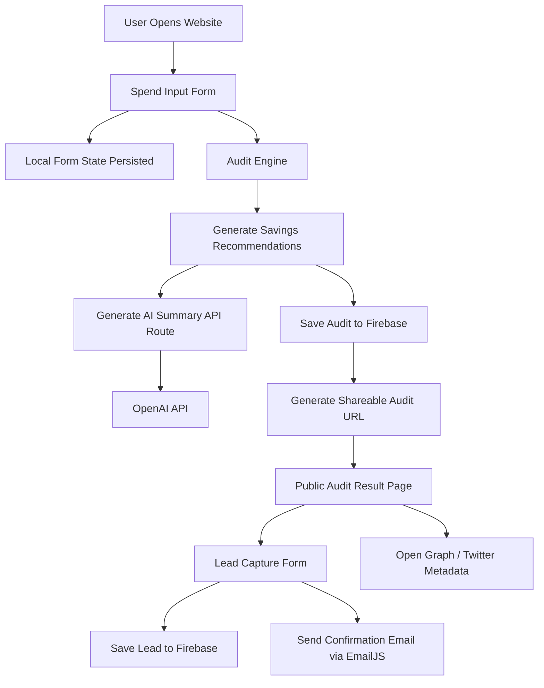

# Architecture

## Overview

AI Spend Audit is a SaaS-style lead-generation and optimization platform designed to help startups identify overspending across AI tooling subscriptions such as ChatGPT, Claude, Cursor, GitHub Copilot, Gemini, and related products.

The application was intentionally designed as:
- a lightweight MVP
- highly shareable
- low-friction
- deployment-friendly
- explainable from both technical and business perspectives

The architecture prioritizes:
- fast iteration
- clear data flow
- minimal operational overhead
- strong frontend UX
- deterministic audit recommendations

---

# System Diagram



---

# Core Architecture Decisions

## 1. Rule-Based Audit Engine Instead of AI Recommendations

The audit engine itself is deterministic and rule-based rather than LLM-generated.

This decision was intentional because:
- financial recommendations should be explainable
- pricing logic should be predictable
- users need transparent savings calculations
- deterministic outputs are easier to test

The AI layer is only used for generating personalized natural-language summaries after the audit calculations are complete.

This separation improves:
- reliability
- trustworthiness
- debuggability
- testability

---

## 2. Next.js App Router Architecture

The application uses Next.js App Router with a split server/client component architecture.

### Server Components
Used for:
- metadata generation
- Open Graph configuration
- route-level rendering

### Client Components
Used for:
- interactive forms
- Firebase reads/writes
- local state
- dynamic UI updates

This separation became especially important after implementing dynamic metadata generation for shareable audit URLs.

---

# Data Flow

## Step 1 — User Input

Users enter:
- AI tools
- subscription plans
- monthly spend
- seat counts
- team size
- primary use case

The form state is persisted locally using `localStorage` so users do not lose progress after refreshes.

---

## Step 2 — Audit Generation

The frontend passes normalized tool data into the audit engine.

The audit engine:
- evaluates pricing heuristics
- identifies downgrade opportunities
- estimates monthly savings
- estimates annual savings
- determines whether Credex should be promoted prominently

The engine returns:
- per-tool recommendations
- total savings
- annualized savings
- reasoning text

---

## Step 3 — AI Summary Generation

After deterministic recommendations are generated, the frontend calls a Next.js API route.

The API route:
- securely initializes the OpenAI SDK
- builds a prompt from audit results
- generates a short personalized summary
- returns fallback text if the API fails

This architecture prevents API credentials from ever reaching the browser.

---

## Step 4 — Audit Persistence

Audit results are stored in Firebase Firestore.

Each audit document contains:
- original user inputs
- generated recommendations
- savings totals
- AI summary
- timestamp

Firestore automatically generates a document ID which becomes the shareable public audit URL.

Example:

```txt
/audit/abc123
```

---

## Step 5 — Shareable Audit Pages

Dynamic audit routes fetch audit data directly from Firestore.

Public versions intentionally exclude:
- email addresses
- company names
- private identifying details

Only:
- tooling stack
- recommendations
- savings information

are exposed publicly.

This supports:
- social sharing
- screenshots
- viral distribution

while minimizing privacy risks.

---

## Step 6 — Lead Capture

Users can optionally submit:
- email
- company name
- role

after receiving audit value.

This sequencing was intentional because:
- value-before-gating improves trust
- friction remains low
- conversion rates increase

Lead data is stored in a dedicated Firestore collection.

---

## Step 7 — Email Confirmation

After successful lead submission:
- EmailJS sends a confirmation email
- users receive audit confirmation
- Credex consultation intent is reinforced

Environment variables are used for all EmailJS credentials.

---

# Why I Chose This Stack

## Next.js

Chosen because it provides:
- fast deployment
- excellent developer experience
- App Router support
- server/client rendering flexibility
- built-in API routes
- strong Vercel integration

The framework also simplified:
- Open Graph metadata generation
- deployment
- routing
- production optimization

---

## TypeScript

TypeScript was used to improve:
- maintainability
- type safety
- audit engine correctness
- CI reliability

As the project grew, typed interfaces significantly reduced integration bugs across:
- Firestore
- audit results
- component props
- API responses

---

## Firebase Firestore

Firestore dramatically accelerated MVP development because it:
- removed backend infrastructure overhead
- handled persistence immediately
- simplified dynamic shareable URLs
- reduced deployment complexity

The tradeoff is reduced backend flexibility compared to a custom database/API architecture.

---

## OpenAI API

OpenAI was used specifically for:
- natural-language personalization
- human-readable audit summaries

The API was intentionally isolated behind server-side routes for security.

---

## EmailJS

EmailJS simplified transactional email delivery without requiring:
- custom SMTP infrastructure
- dedicated backend queues
- additional deployment complexity

This was especially valuable for rapid MVP iteration.

---

# Open Graph Metadata

Audit pages expose:
- Open Graph metadata
- Twitter card metadata

to support rich previews when shared on:
- X/Twitter
- Discord
- Slack
- LinkedIn

This improves:
- virality
- screenshot sharing
- click-through rates
- product discoverability

---

# Abuse Protection

The lead capture form includes a lightweight honeypot field to reduce automated spam submissions.

This approach was chosen because it:
- adds zero UX friction
- requires no CAPTCHA interaction
- works well for MVP-scale traffic

More advanced rate limiting would likely be necessary at larger scale.

---

# Testing Strategy

The project includes automated Vitest coverage for the audit engine.

Tests validate:
- downgrade recommendation logic
- savings calculations
- Credex recommendation thresholds
- already-optimal plan handling

GitHub Actions automatically runs:
- linting
- tests

on every push to `main`.

---

# What I Would Change at 10k Audits/Day

If the product needed to scale significantly, I would make several architectural changes.

## 1. Move Audit Logic Server-Side

Currently some recommendation logic runs client-side for simplicity and responsiveness.

At larger scale:
- centralized server-side evaluation
- rate limiting
- analytics
- abuse prevention

would become more important.

---

## 2. Add Caching Layer

Popular public audit pages and metadata would benefit from:
- Redis caching
- edge caching
- ISR/revalidation

to reduce repeated Firestore reads.

---

## 3. Replace Firestore With Dedicated Backend Services

As complexity increased, I would likely migrate toward:
- Postgres
- Prisma
- dedicated API services

for:
- stronger relational querying
- analytics pipelines
- organizational accounts
- billing workflows

---

## 4. Add Analytics Infrastructure

At scale I would introduce:
- PostHog
- Mixpanel
- event pipelines
- funnel analytics

to better understand:
- conversion behavior
- audit completion dropoff
- viral sharing dynamics

---

## 5. Queue AI Summary Generation

LLM requests would eventually move into:
- background queues
- async processing
- retry systems

to reduce latency and improve reliability under heavy load.

---

# Security Considerations

The application avoids exposing secrets by:
- isolating OpenAI usage server-side
- storing environment variables securely
- excluding sensitive user details from public audit pages

No authentication was added intentionally because:
- reducing friction was critical
- the product is designed for quick anonymous audits
- lead capture occurs after value delivery

---

# Deployment

The application is deployed on Vercel.

Deployment pipeline:
- GitHub push
- automatic Vercel deployment
- CI validation
- production build generation

This provides:
- rapid iteration
- easy rollback support
- preview deployments
- production-ready hosting