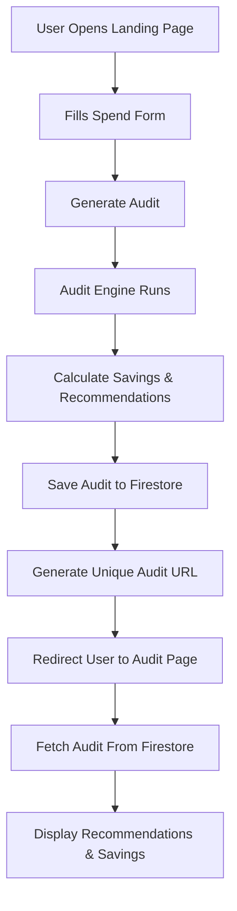

# Architecture

## Overview

AI Spend Audit is a lightweight SaaS-style web application that helps startups evaluate and optimize spending across AI tooling subscriptions such as ChatGPT, Claude, Cursor, GitHub Copilot, Gemini, and similar products.

The application is intentionally designed around:
- fast iteration
- low infrastructure overhead
- simple rule-based audit logic
- shareable public audit reports
- lead generation for Credex

The current implementation prioritizes shipping speed, clarity, and maintainability over premature optimization.

---

# Stack Choice

## Frontend
- Next.js 16 (App Router)
- React
- TypeScript
- Tailwind CSS

### Why Next.js
Next.js was chosen because it provides:
- dynamic routing for shareable audit pages
- good SEO support
- easy deployment on Vercel
- strong developer experience
- server/client rendering flexibility
- built-in metadata support for future Open Graph previews

### Why TypeScript
TypeScript improves:
- audit engine reliability
- maintainability
- safer refactoring
- better debugging during rapid iteration

### Why Tailwind CSS
Tailwind was selected for:
- fast UI iteration
- consistent styling
- responsive layouts
- avoiding large custom CSS files

---

# Backend & Database

## Firebase Firestore

Firestore is used for:
- storing completed audits
- generating unique shareable audit URLs
- lightweight backend persistence

### Why Firebase
Firebase was chosen because:
- setup speed is extremely fast
- no backend server management required
- automatic document IDs simplify public audit URLs
- sufficient for MVP-scale traffic
- integrates cleanly with Next.js client components

---

# Audit Engine Design

The audit engine is intentionally rule-based rather than AI-generated.

Example logic:
- ChatGPT Team is inefficient for teams smaller than 3 users
- Cursor Business is unnecessary for very small engineering teams
- Claude Team plans are overkill for low seat counts

The reasoning for using deterministic rules:
- pricing recommendations should be explainable
- financial recommendations need predictable outputs
- AI hallucinations would reduce trustworthiness
- rules are easier to test and validate

The audit engine currently:
1. evaluates each tool independently
2. checks for downgrade opportunities
3. calculates monthly savings
4. calculates annual savings
5. determines whether Credex recommendations should be shown

---

# Data Flow



---

# Current Project Structure

```txt
app/
  audit/[id]/
  page.tsx

components/
  SpendForm.tsx

lib/
  auditEngine.ts
  firebase.ts
  saveAudit.ts

data/
  pricing.ts

types/

tests/
```

---

# Shareable Audit URLs

Each audit is saved as a Firestore document.

Firestore automatically generates unique IDs such as:

```txt
/audit/abc123xyz
```

This enables:
- public sharing
- future Open Graph previews
- viral distribution loops
- easier analytics tracking

Sensitive information such as email or company details will not be exposed in public audit pages.

---

# Scaling Considerations (10k audits/day)

If the application needed to support significantly higher scale, I would change several things:

## Move Audit Logic to API Routes
Currently some logic runs client-side for development speed.

At higher scale:
- move calculations to server-side API routes
- centralize recommendation logic
- reduce client bundle size

## Add Caching
Frequently repeated audit configurations could be cached using:
- Redis
- Vercel Edge Config
- CDN caching

## Separate Public & Private Data
Public audit results and private lead data should live in separate collections/tables with stricter permissions.

## Queue AI Summary Generation
AI-generated summaries should move to:
- background jobs
- queues
- async processing

This prevents slower LLM response times from affecting UX.

## Stronger Validation & Abuse Protection
At scale I would add:
- rate limiting
- CAPTCHA
- server-side schema validation
- IP throttling

---

# Tradeoffs Made

## Firebase vs Custom Backend
Firebase sacrifices some backend flexibility but dramatically increases shipping speed for an MVP.

## Rule-Based Logic vs AI Recommendations
Hardcoded rules are less flexible but significantly more trustworthy for financial optimization recommendations.

## Client Components vs Server Components
Client components simplified local state handling and Firebase integration during rapid development, even though server-heavy architecture may scale better long-term.

## Minimal Authentication
The MVP intentionally avoids authentication friction to maximize conversion rates and audit completion.

---

# Future Improvements

Planned future improvements include:
- AI-generated personalized summaries
- PDF report export
- Open Graph image generation
- benchmark comparisons
- transactional emails
- analytics instrumentation
- referral system
- admin dashboard
- pricing auto-sync from vendor APIs